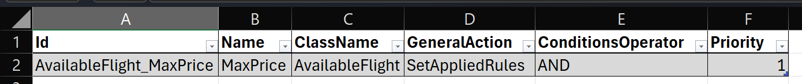
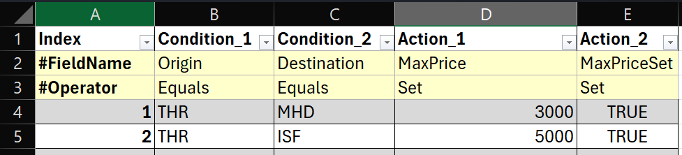
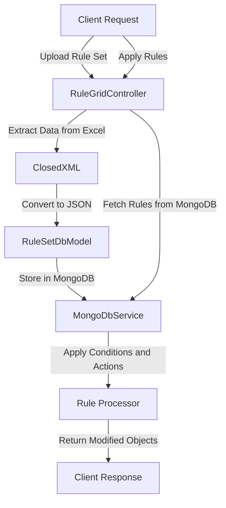

# Apex.RuleGrid  
FREE Excel-based minimal and simple rule-engine that can be integrated into any application.

## Overview

The RuleGrid project is a .NET 8 **Excel-Based** application designed to manage and apply business rules stored in MongoDB. It provides functionality to upload rule sets from Excel files, convert them to JSON, and store them in a MongoDB database. Additionally, it allows applying these rules to a set of objects.

## Features

- Upload rule sets from Excel files.
- Convert Excel data to JSON format.
- Store and retrieve rule sets from MongoDB.
- Apply rules to objects based on specified conditions and actions.
- **Structured logging** with Serilog for enhanced observability and debugging.
- **Request/Response tracing** with correlation IDs for distributed system monitoring.
- **Performance monitoring** with detailed metrics for rule processing operations.
- **Configurable log outputs** including console, file, and Seq integration.

## Technologies Used

- .NET 8
- C# 12.0
- ASP.NET Core
- MongoDB
- ClosedXML (for Excel file handling)
- Swashbuckle (for API documentation)
- Serilog (for structured logging)
- .NET Aspire (for observability and service defaults)

## Project Structure

### Controllers

- **RuleGridController.cs**: Handles the uploading of rule sets and applying rules to objects.

### Services

- **MongoDbService.cs**: Provides methods to interact with MongoDB, including saving and retrieving rule sets.
- **RuleEngineService.cs**: This is the core service of rule processor and applies rules to objects.

### Models

- **RuleSetDbModel.cs**: Represents the rule set stored in MongoDB.
- **Rule.cs**: Represents an individual rule with conditions and actions.
- **MetaData.cs**: Represents metadata associated with a rule set.
- **RuleApplicationRequest.cs**: Represents the request model for applying rules.

## Getting Started

### Prerequisites

- .NET 8 SDK
- MongoDB instance
- Visual Studio 2022

### Configuration

1. **MongoDB Configuration**: Update the `appsettings.json` file with your MongoDB connection string and database name.

    ```json
    {
        "MongoDB": {
            "ConnectionString": "your-mongodb-connection-string",
            "DatabaseName": "your-database-name"
        }
    }
    ```

### Excel File Format

> - The Excel file should contain two sheets: Metadata and Rules.  
> - The Metadata sheet should contain the following columns: `Id`, `Name`, `ClassName`, `GeneralAction`, `ConditionsOperator`, `Priority`.  
> - The Rules sheet should contain the following columns: `Index`, `Condition_X`, `Action_X`.  
> - The `X` in `Condition_X` and `Action_X` represents the index of the condition or action.  
> - The `ConditionsOperator` column in the Metadata sheet should contain one of the following values: `AND`, `OR`.  
> - The `Priority` column in the Metadata sheet should contain an integer value.  
> - The `GeneralAction` column in the Metadata sheet can contain one of the following values: `SetAppliedRules`.  
> - The `Index` column in the Rules sheet should contain an integer value or `#FieldName`/`#Operator` for first two rows.  
> - The `Condition_X` column in the Rules sheet should contain the condition expression.  
> - The `Action_X` column in the Rules sheet should contain the action expression.  
> - The `ClassName` column in the Metadata sheet should contain the class name to which the rules will be applied.  
> - The `Name` column in the Metadata sheet should contain the name of the rule set.  
> - The `Id` column in the Metadata sheet should contain a unique identifier for the rule set.  
> - Conditions and actions can be one or more columns in the Rules sheet.  
> - The `ConditionsOperator` column in the Metadata sheet should contain the operator to be used for combining conditions.  
> - The `Priority` column in the Metadata sheet should contain the priority of the rule set.  
> - Conditions operator can be `Equals`, `GreaterThan`, `LowerThan`.  
> - Actions operator can be `Set`, `Increase`, `Decrease`.

#### Sheet one (Metadata):


#### Sheet two (Rules):


## Logging

The RuleGrid project uses **Serilog** for structured logging throughout the application. This provides rich, searchable log data with contextual information.

### Configuration

Logging is configured through the `appsettings.json` files and integrated with the .NET Aspire service defaults.

#### Basic Configuration

The application supports multiple sinks (output destinations):

- **Console**: Formatted console output for development
- **File**: Rolling daily log files stored in the `logs/` directory
- **Seq**: Structured logging server (optional, requires Seq to be running)

#### Configuration Example

```json
{
  "Serilog": {
    "MinimumLevel": {
      "Default": "Information",
      "Override": {
        "Microsoft": "Warning",
        "Microsoft.AspNetCore": "Warning",
        "System": "Warning"
      }
    },
    "WriteTo": [
      {
        "Name": "Console",
        "Args": {
          "outputTemplate": "[{Timestamp:HH:mm:ss} {Level:u3}] {Message:lj} {Properties} {NewLine}{Exception}"
        }
      },
      {
        "Name": "File",
        "Args": {
          "path": "logs/app-.log",
          "rollingInterval": "Day",
          "retainedFileCountLimit": 7,
          "outputTemplate": "{Timestamp:yyyy-MM-dd HH:mm:ss.fff zzz} [{Level:u3}] [{SourceContext}] {Message:lj} {Properties} {NewLine}{Exception}"
        }
      },
      {
        "Name": "Seq",
        "Args": {
          "serverUrl": "http://localhost:5341"
        }
      }
    ],
    "Enrich": ["FromLogContext", "WithEnvironmentName", "WithProcessName", "WithProcessId", "WithThreadId", "WithCorrelationId"],
    "Properties": {
      "ApplicationName": "Apex.RuleGrid"
    }
  }
}
```

#### Environment-Specific Configuration

- **Development**: Debug level logging with Seq integration
- **Production**: Information level logging with file and console output

### Enrichers

The application automatically enriches all log events with:

- **Environment Name**: Development, Production, etc.
- **Process Information**: Process name and ID
- **Thread ID**: Current thread identifier
- **Correlation ID**: Request correlation for tracing
- **Application Name**: Set to "Apex.RuleGrid"

### Structured Logging Features

#### API Request/Response Logging

All API endpoints automatically log:
- Request parameters and payloads
- Processing time and outcomes
- Error conditions with full exception details
- Rule application statistics

#### Database Operations

MongoDB operations include:
- Connection details (without sensitive information)
- Query performance metrics
- Data modification tracking
- Error handling and retry logic

#### Rule Engine Processing

Rule processing logs provide:
- Rule set metadata and statistics
- Individual rule execution results
- Performance metrics
- Excel file processing details

### Log Examples

#### Successful Rule Application
```
[14:16:32 INF] Applying rules for "Customer" to 5 objects {ClassName="Customer", ObjectCount=5, EnvironmentName="Development"}
[14:16:32 INF] Found 2 rule sets for class "Customer" {RuleSetCount=2, ClassName="Customer"}
[14:16:32 DBG] Applied rule "1" from rule set "CUST-001" {RuleIndex="1", RuleSetId="CUST-001"}
[14:16:32 INF] Successfully applied rules for "Customer". Processed 5 objects {ClassName="Customer", ObjectCount=5}
```

#### File Upload Processing
```
[14:16:30 INF] Processing 1 rule set files {FileCount=1}
[14:16:30 INF] Processing Excel file "customer-rules.xlsx" with size 15432 bytes {FileName="customer-rules.xlsx", FileSize=15432}
[14:16:30 INF] Converted to database model. RuleSetId: "CUST-001", RuleCount: 12 {RuleSetId="CUST-001", RuleCount=12}
[14:16:30 INF] Successfully processed and saved rule set from "customer-rules.xlsx" {FileName="customer-rules.xlsx"}
```

### Integration with OpenTelemetry

Serilog works alongside the existing OpenTelemetry configuration:
- Trace correlation across distributed services
- Metrics integration for performance monitoring
- Compatibility with .NET Aspire observability stack

### Seq Integration (Optional)

For enhanced log analysis, you can run Seq locally:

```bash
docker run --name seq -d --restart unless-stopped -e ACCEPT_EULA=Y -p 5341:80 datalust/seq:latest
```

Then access the Seq UI at `http://localhost:5341` to:
- Search and filter structured logs
- Create custom dashboards
- Set up alerting rules
- Analyze application performance trends

### Log File Management

- Log files are created daily in the `logs/` directory
- Files are retained for 7 days by default
- File names follow the pattern: `app-YYYY-MM-DD.log`
- Logs are automatically excluded from version control

### Running the Application

1. Open the solution in Visual Studio 2022.
2. Build the solution to restore the dependencies.
3. Ensure MongoDB is running (see MongoDB Configuration above).
4. Run the application.

The application will start with structured logging enabled. You can monitor logs in:
- Console output (real-time)
- Log files in the `logs/` directory
- Seq dashboard (if configured)

### API Endpoints

#### Upload Rule Set
- **Endpoint**: `POST /api/v1/RuleEngine/upload-ruleset`
- **Description**: Uploads an Excel file containing rule sets.
- **Request**: `multipart/form-data` with one or more files.

#### Apply Rules

- **Endpoint**: `POST /api/v1/RuleEngine/apply-rules`
- **Description**: Applies rules to a set of objects.
- **Request**: JSON body containing `ClassName` and `Objects`.

    ```json
    {
      "ClassName": "example-class",
      "Objects": [
            {
              "property1": "value1",
              "property2": "value2"
            }
      ]
    }
    ```

### Workflow Diagram



## Example Usage

### Uploading a Rule Set

1. Use a tool like Postman to send a `POST` request to `/api/v1/RuleEngine/upload-ruleset`.
2. Attach the Excel file(s) containing the rule sets.

### Applying Rules

1. Use a tool like Postman to send a `POST` request to `/api/v1/RuleEngine/apply-rules`.
2. Provide the `ClassName` and `Objects` in the request body.

## Contributing

Contributions are welcome! Please open an issue or submit a pull request for any improvements or bug fixes.

## License

This project is licensed under the MIT License.

## Contact

For any questions or support, please contact the project maintainers.

[@miladashrafi](https://github.com/miladashrafi/)

---

This README file provides a comprehensive overview of the RuleGrid project, including its features, technologies used, project structure, and instructions for getting started.

